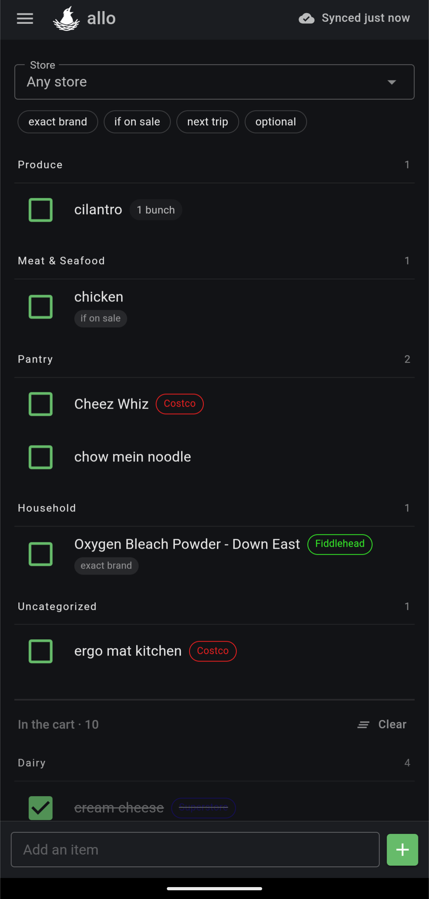

# allo

A self-hosted shopping list for a family, built to work in the dead spots at the back of a
grocery store.

No flyers, no deals, no scraping, no accounts on someone else's server. Fast entry,
categories you control, and sync that survives a bad signal.

<p align="center">
  
</p>

<p align="center"><sub>Categories in walking order · tags you can filter on · per-store pills · checked items out of the way but still reviewable</sub></p>

## The constraint that drives everything

Grocery stores have dead spots. That single fact shapes the whole design.

Every action writes to the device first and updates the screen immediately — the network is
never in the path of you seeing your own change. Add items, check things off, edit
quantities with the signal gone, and it reconciles when it comes back. The app is a
standalone WebAssembly client, not a server-rendered one, precisely so a dropped connection
in aisle nine doesn't leave you staring at a frozen page.

## What it does

- **Fast entry.** Type "2 lb ground beef", press enter, keep typing. The keyboard stays up.
- **Learns your categorisation.** A catalog of 599 common groceries ships with it, matched
  by name, alias and plural. Correct a category once and it remembers; set an unusual unit
  or tag twice in a row and that becomes the default.
- **Categories in walking order**, not alphabetical. "Uncategorized" is a real category that
  always sorts last, so nothing goes missing.
- **Stores as a filter, with colours.** Attach an item to Costco and it shows only when
  Costco is selected — or mark it any-store and it always shows.
- **Tags.** Type `#sale` inline while adding, or pick from the ones you already use. Tags
  filter the list; they never change its order.
- **Checked items move to an "In the cart" section** at the bottom, keeping the live list
  short while you shop, still reviewable, one tap to put something back.
- **Quantities with real units** — `ea`, `g`, `kg`, `lb`, `ml`, `l`, `gal`, `bunch`, `dozen`
  — stored as codes, never integers, so the data stays readable.
- **Installs as a real app** on Android from Chrome. Offline shell, and a new version is
  offered rather than forced on you mid-aisle.

## What it is not

Worth being clear before you spend time on it:

- **Family scale.** Four or five accounts, no roles, no public sign-up. Any member can add
  another member — deliberate, and wrong for anything larger.
- **Single tenant.** One household per instance. Running it for friends means running a
  container each.
- **No price tracking, no flyers, no meal planning.** Those were considered and parked.

## Running it

The image serves the API and the client from one origin, so there is no CORS and the auth
cookie just works.

```bash
docker run -d --name allo \
  -p 8080:8080 \
  -v /path/to/appdata:/appdata \
  -e Admin__Username=you \
  -e Admin__InitialPassword=change-this-at-first-login \
  -e Admin__DisplayName=You \
  ghcr.io/jamesakidd/allo:latest
```

Or with compose:

```yaml
services:
  allo:
    image: ghcr.io/jamesakidd/allo:latest
    ports: ["8080:8080"]
    volumes: ["./appdata:/appdata"]
    environment:
      Admin__Username: you
      Admin__InitialPassword: change-this-at-first-login
      Admin__DisplayName: You
      ForwardedHeaders__KnownProxies__0: 192.168.1.176
    restart: unless-stopped
```

**Unraid users:** there is a template at [`deploy/allo.xml`](deploy/allo.xml). Drop it in
`/boot/config/plugins/dockerMan/templates-user/` and it appears in the Add Container
template list.

### Configuration

Everything is an environment variable. A variable left blank counts as unset.

| Variable | Default | What it does |
| --- | --- | --- |
| `Admin__Username` | — | Creates the first account, **only** when no account exists |
| `Admin__InitialPassword` | — | Temporary; the app forces a change at first login. Minimum 8 characters |
| `Admin__DisplayName` | username | Name shown on that account |
| `ForwardedHeaders__KnownProxies__0` | none | Your reverse proxy's IP. See below |
| `Auth__LoginAttemptsPerMinute` | `5` | Failed logins per client address before a 429 |
| `ConnectionStrings__Default` | `Data Source=/appdata/allo.db` | Leave it inside the volume |
| `DataProtection__KeysPath` | `/appdata/keys` | Leave it inside the volume |

The `/appdata` volume holds the SQLite database **and** the cookie encryption keys. Both
must survive a container update — lose the keys and everyone is logged out holding a cookie
nothing can decrypt. Back up the whole folder.

### Behind a reverse proxy

**HTTPS with a valid certificate is not optional if you want the offline behaviour.** Service
workers only run in a secure context, so over plain HTTP on a LAN address the app still
works but caches nothing, installs nowhere, and dies the moment the signal does.

Set `ForwardedHeaders__KnownProxies__0` to your proxy's address. Without it every request
appears to come from the proxy over HTTP, so the login rate limiter treats your whole
household as one client and the auth cookie is never marked `Secure`. Only addresses listed
there are trusted, and the framework's default trusted networks are cleared — honouring
`X-Forwarded-For` from anyone would let a caller invent an address per request and walk
around the rate limit.

Turn off any asset caching on the proxy. It can serve a stale service worker and strand
clients on an old build.

### Backups

[`deploy/backup-allo.sh`](deploy/backup-allo.sh) is written for Unraid's User Scripts plugin
but is ordinary bash. It stops the container, archives the database and the keys together,
restarts it, and prunes old archives.

It stops the container on purpose. SQLite is a file, not a server: a copy taken mid-write can
be torn, and the tear is silent until you try to restore. A few seconds of downtime is the
cheap side of that trade.

## How it works

The parts worth knowing if you're reading the code.

**Sync is last-write-wins per field group, ordered by the server.** A single monotonic
counter stamps a `Sequence` on every accepted change, and clients pull "everything after
number N". Client clocks are never trusted to decide anything. Each entry has two
independent field groups — content and checked-state — so one person changing milk from 1 to
2 while another checks it off keeps both changes, where row-level last-write-wins would lose
one.

**Deletes are final.** Tombstones, never hard deletes; `SaveChanges` throws if you try. A
phone coming back online cannot resurrect items someone else cleared.

**One bad row never stalls a queue.** Pushes apply row by row; a rejected row comes back with
the server's version and the phone drops its own change.

**Duplicate items merge.** Two people adding "lingonberry jam" offline end up with one
catalog item, not two — the server tells each phone to swap the id.

**The offline store is per-table browser storage plus a pending queue keyed by field group**,
with revisions, so an edit made while a push is in flight isn't wiped by that push's
response.

**The service worker caches the whole shell and records what it cached**, so the next build
reuses the parts that didn't change. Measured on a real deploy: a cold install fetches 118
framework files, an update that touched one stylesheet fetched none. The payload is 12.1 MB
raw, 3.6 MB over the wire with Brotli, and nothing at all after the first load.

[`TODO.md`](TODO.md) carries every design decision with the reasoning behind it, including
the ones that were rejected. It is the honest record, not a marketing document.

## Development

Requires the .NET 10 SDK. No other tooling.

```bash
dotnet run --project Allo.Api --launch-profile http   # API + client on http://localhost:5043
dotnet test Allo.slnx                                 # 159 tests
```

`Allo.Api` serves the published WebAssembly client in development too, so local runs match
production. Stop it before rebuilding — a running instance locks its own output.

- `Allo.Shared` — models, sync engine, catalog matching, list logic. No EF dependency, so the
  client and server share the same code.
- `Allo.Api` — minimal API, EF Core configuration, migrations, seeding.
- `Allo.Client` — Blazor WebAssembly, MudBlazor, dark theme, system fonts only so nothing is
  fetched at runtime.

## License

[GPL-3.0](LICENSE)
